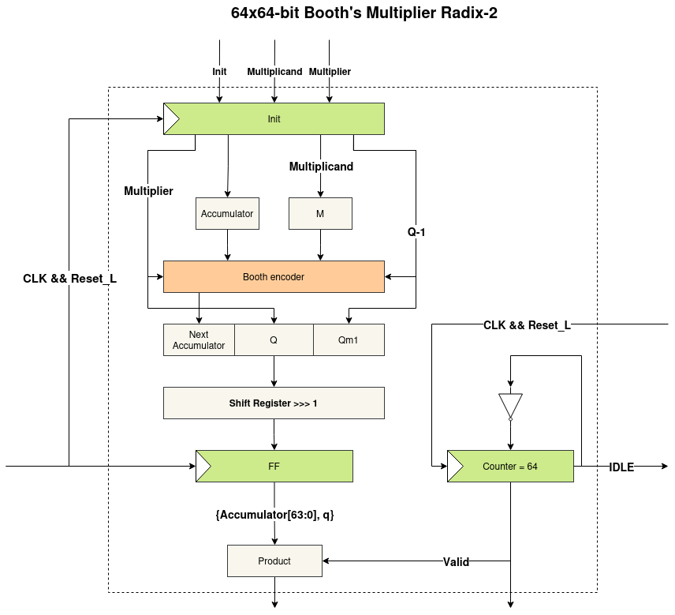

# FPGAs-Proyecto1

## Descripción del proyecto

Este repositorio contiene la implementación y resultados de **tres diseños** descritos en el enunciado del **Proyecto Corto 1**.  
El objetivo es implementar los diseños en HDL utilizando SystemVerilog/Verilog, sintetizarlos e implementarlos en Vivado, y reportar resultados de **utilización** y **timing**.

## Explicación de los diseños

### Diseño 1 

El diseño 1 implementa un multiplicador de 64x64 bits utilizando una arquitectura de uniciclo. Este presenta cuatro entradas de 32 bits que representan la parte lsb y msb de los buses de datos que se desean operar, además de una entrada de reloj. Para la salida, presenta un resultado descomupesto en cuatro salidas de 32 bits. Dicho diseño se debe al GPIO utilizado que posee entradas y salidas de 32 bits.

Los pasos realizados por el multiplicador son:

1. Recibir las cuatro entradas de 32 bits que representan a(lsb), a(msb), b(lsb) y b(msb), donde a y b son los factores en la multiplicación de 64 bits, así como la entrada del reloj.
2. Concatenar a(lsb), a(msb), b(lsb) y b(msb) para realizar la multiplicación a*b.
3. Ejecución de la multiplicación a*b.
4. Asignar en cada flanco positivo del reloj, las salidas del producto descompuesto en cuatro canales de 32 bits. 

El diseño lógico de la microarquitectura se presenta a continuación en forma de diagrama de bloques:


### Diseño 2
El diseño 2 implementa el multiplicador de 64x64 bits utilizando una arquitectura segmentada de multiplicadores de 8x8 con suma de productos parciales y registros. El diseño presenta las siguientes etapas:
1. 64 Multiplicadores 8x8 que calculan los productos parciales de cada byte de los operandos de entrada: a y b.
2. Etapa de pipeline antes de desplazamiento.
3. 64 módulos de desplazamiento para extender los productos parciales a 128 bits.
4. Árbol de sumas de productos parciales segmentado:
   
   4.1. Nivel 1: 64 -> 32 sumas + Etapa de pipeline
   
   4.2. Nivel 2: 32 -> 16 sumas + Etapa de pipeline
   
   4.3. Nivel 3: 16 -> 8 sumas + Etapa de pipeline

   4.4. Nivel 4: 8 -> 4 sumas + Etapa de pipeline

   4.5. Nivel 5: 4 -> 2 sumas + Etapa de pipeline

   4.6. Nivel 6: 2 -> suma final + Etapa de pipeline
### Diseño 3

El diseño 3 implementa el multiplicador de 64x64 bits usando el algoritmo de multiplicación de Booth (usando radix-2). Este algoritmo se usa para multiplicar dos números con signo. El algoritmo presenta los siguientes pasos:

1. Inicializar los valores de los registros:
  1.1 A = 0 (Acumulador).
  1.2 Qm1 = 0
  1.3 M = multiplicando.
  1.4 Q = multiplicador.
  1.5 Por ser de 64 bits el contador tendrá un valor inicial de 64 bits.
2. Revisar el valor de {Q, Qm1}. Si es 00 ó 11 ir al paso 5. Si es 01 ir al paso 3 y si es 10 ir al paso 4.
3. Calcular next_A = A + M.
4. Calcular next_A = A - M.
5. Realizar un acarreo aritmético de {A, Q, Qm1} y decrementar el contador en 1.
6. Si el contador es 0, ir al paso 7. Si el contador es distinto de 0 ir al paso 2.
7. Terminar y declarar el producto como válido.

El diseño lógico de la microarquitectura se presenta a continuación en forma de diagrama de bloques:



## Instrucciones de construcción

### Vivado (GUI)
1. Abrir Vivado.
2. Crear un proyecto para la Kria KV260 y seleccionar los archivos ubicados en la carpeta del diseño:
   - `D1/` o `D2/` o `D3/`
2. Generar el diagrama de bloques (PS + PL) y conexiones entre módulos.
3. Correr:
   - **Run Synthesis**
   - **Run Implementation**
4. Generar reportes:
   - **Report Utilization**
   - **Report Timing Summary**

## Árbol de archivos con su descripción
```
.
├─ img/
|  └─ booth_multiplier.png    # Diagrama de bloques del multiplicador de Booth
├─ D1/
│  └─ mul64x64_uniciclo.v     # RTL del multiplicador 64x64 uniciclo
├─ D2/
│  ├─ mul64x64.sv             # Módulo top del multiplicador 64x64
│  ├─ mul64x64_wrapper.v      # Wrapper del top en Verilog
│  ├─ mul8x8.sv               # Módulo del multiplicador 8x8
│  ├─ shifter.sv              # Módulo de desplazamiento de productos parciales
│  └─ sum_tree.sv             # Árbol de sumas
└─ D3/
   ├─ booth_multiplier.sv     # RTL del multiplicador de Booth
   └─ booth_multiplier_wrap.v # Wrapper del multiplicador de Booth (debe ser el Top)
```

## Tabla de resultados (AMD Kria KV260, 300 MHz)

| Parámetro | Diseño 1 | Diseño 2 | Diseño 3 |
|----------|----------|----------|----------|
| Timing / delay de la ruta crítica (ns) | 7.001 | 3.294 | 2,723 |
| Frecuencia máxima lograda (MHz) | 142.8 | 303.6 | 367,2 |
| Latencia (ciclos) | 1 | 7 | 64 |
| LUT (CLB LUTs) | 173 | 5475 | 141 |
| FF (CLB Registers) | 128 | 3664 | 330 |

-------

### MP-6166 Diseño Avanzado con FPGAs
### Maestría en Ingeniería Electrónica
### Instituto Tecnológico de Costa Rica
### Profesor Ph. D. León Vega, Luis Gerardo

### Estudiantes

Aguero Villagra, Leonardo Enrique

Cruz Soto, Federico Alonso

Fallas Mejía, Jorge Isaac

Gutiérrez Quesada, Allan Mauricio
